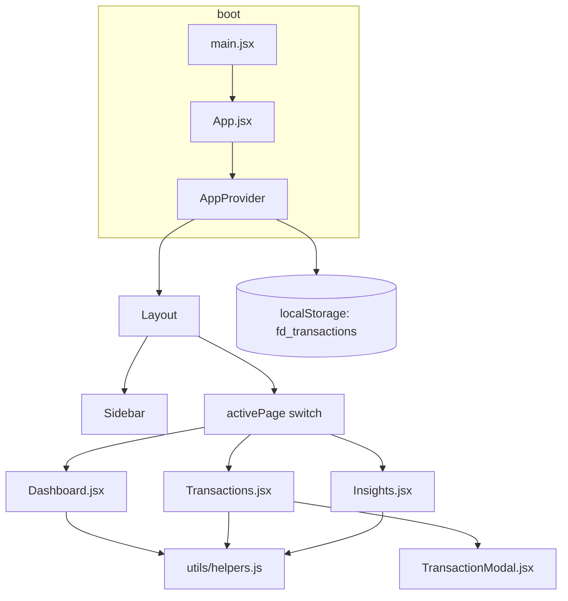

# FinanceOS — Project documentation

This document describes the **finance-dashboard** (FinanceOS) codebase end to end: purpose, architecture, data flow, state API, file map, and how to run and extend it.

---

## 1. Purpose

FinanceOS is a **single-page finance dashboard** for viewing income, expenses, and derived insights. It is a **frontend-only** app: no backend, no real authentication. Roles (viewer vs admin) and transaction data are simulated in the browser; persistence uses **localStorage**.

---

## 2. Tech stack

| Area | Technology |
|------|------------|
| UI | React 19 |
| Build | Vite 8 |
| Styling | Tailwind CSS v4 via `@tailwindcss/vite` (`@import "tailwindcss"` + `@theme` in `src/index.css`) |
| Charts | Recharts 3 |
| Global state | React Context + `useReducer` (`src/context/AppContext.jsx`) |
| Lint | ESLint 9 + React plugins |

---

## 3. High-level architecture



- **Navigation** is not URL-based: `activePage` in context is one of `dashboard` | `transactions` | `insights`.
- **Transactions** live in context; **mutations** (add/edit/delete) write JSON to `localStorage` key `fd_transactions`. On load, saved data **replaces** the in-memory list if parse succeeds.

---

## 4. Entry and application shell

| File | Role |
|------|------|
| `index.html` | Mount point `#root` |
| `src/main.jsx` | `createRoot`, `StrictMode`, imports `index.css` |
| `src/App.jsx` | Wraps tree in `AppProvider`; `Layout` maps `state.activePage` to page component; mobile header + hamburger; overlay closes menu; **Escape** closes menu; **body scroll lock** when menu open; **≥1024px** closes mobile menu on resize |

---

## 5. State management (`src/context/AppContext.jsx`)

### 5.1 Initial state

```js
{
  transactions: INITIAL_TRANSACTIONS,  // from mockData
  role: "viewer",
  filters: { search: "", category: "all", type: "all", month: "all" },
  activePage: "dashboard",
}
```

### 5.2 Actions (`dispatch`)

| Action | Payload | Effect |
|--------|---------|--------|
| `SET_ROLE` | `"viewer"` \| `"admin"` | Updates `role` |
| `SET_PAGE` | `"dashboard"` \| `"transactions"` \| `"insights"` | Updates `activePage` |
| `SET_FILTER` | Partial `filters` object | Merges into `filters` |
| `RESET_FILTERS` | — | Restores default filters |
| `ADD_TRANSACTION` | Omit `id` (new tx fields) | Prepends row with `id: Date.now()`, saves array to `fd_transactions` |
| `EDIT_TRANSACTION` | Full transaction including `id` | Replaces matching `id`, saves to storage |
| `DELETE_TRANSACTION` | `id` (number) | Removes row, saves to storage |
| `LOAD_FROM_STORAGE` | `transactions` array | Replaces `transactions` (used once on mount if localStorage valid) |

### 5.3 Hooks

- `useApp()` → `{ state, dispatch }` from `AppContext`.

---

## 6. Data model

### 6.1 Transaction shape

Each transaction is a plain object:

| Field | Type | Notes |
|-------|------|--------|
| `id` | number | Stable identifier; new rows use `Date.now()` |
| `date` | string | `YYYY-MM-DD`; month filters use `date.slice(0, 7)` |
| `description` | string | Search target |
| `category` | string | One of `CATEGORIES` in `mockData.js` (recommended) |
| `type` | `"income"` \| `"expense"` | Drives summaries and charts |
| `amount` | number | Positive; validation in modal rejects NaN / ≤ 0 |

### 6.2 Seed and categories (`src/data/mockData.js`)

- **`CATEGORIES`** — dropdown options for forms/filters.
- **`INITIAL_TRANSACTIONS`** — 47 mock rows (Jan–Mar 2026).
- **`CATEGORY_COLORS`** — hex map for Recharts (donut, bars, insight chips).

### 6.3 localStorage contract

- **Key:** `fd_transactions`
- **Value:** JSON array of transaction objects (same shape as above).
- **Hydration:** If the key exists and `JSON.parse` succeeds, `LOAD_FROM_STORAGE` runs on mount; invalid JSON is ignored (empty `catch`).

---

## 7. Utilities (`src/utils/helpers.js`)

| Function | Purpose |
|----------|---------|
| `formatCurrency(amount)` | INR via `Intl.NumberFormat("en-IN")`, 0 fraction digits |
| `formatDate(dateStr)` | Short locale date |
| `getMonthLabel(dateStr)` | Month + year label |
| `getSummary(transactions)` | `{ income, expenses, balance }` where `balance = income - expenses` |
| `getMonthlyData(transactions)` | Per `YYYY-MM`: income, expenses, label, monthly balance; sorted by month |
| `getCategoryBreakdown(transactions)` | Expense totals by category, descending |
| `getInsights(transactions)` | `topCategory`, `monthComparison` (last two months’ expenses), `avgExpense`, `byCategory` |
| `applyFilters(transactions, filters)` | Search (description/category), category, type, month prefix |
| `getUniqueMonths(transactions)` | Distinct `YYYY-MM`, newest first |

---

## 8. Pages

### 8.1 Dashboard (`src/pages/Dashboard.jsx`)

- Reads **all** `state.transactions` (no transaction filters from context).
- **~900 ms** simulated load → `SkeletonLoader` then content.
- **Summary cards:** balance, income, expenses, savings rate callout.
- **Recharts:** monthly bar (income vs expense), area (running balance over sorted monthly series), pie (expense by category).
- **Recent transactions:** six newest by date.
- Custom tooltips; empty states when no chart data.

### 8.2 Transactions (`src/pages/Transactions.jsx`)

- **Filters:** search, type, category, month — bound to context `filters` via `SET_FILTER`.
- **Sort:** local state `sortBy` (`date` | `amount` | `description`) and `sortDir` (`asc` | `desc`).
- **Admin:** “Add Transaction”, row edit/delete; **Viewer:** read-only table.
- **Delete:** `window.confirm` then `DELETE_TRANSACTION`.
- **Modal:** `TransactionModal` for add/edit.

### 8.3 Insights (`src/pages/Insights.jsx`)

- Uses `getInsights`, `getMonthlyData`, savings rate from totals.
- Stat cards: top spending category, month-on-month expense %, savings rate + guidance.
- **Vertical bar chart** (category breakdown) and **monthly expense trend** as a vertical `BarChart` on `monthly` data (`expenses` per month).
- Plain-English observation blocks derived from the same aggregates.

---

## 9. Components

| Component | File | Responsibility |
|-----------|------|----------------|
| Sidebar | `Sidebar.jsx` | Nav items dispatch `SET_PAGE`; role toggle `SET_ROLE`; mobile drawer props `mobileOpen`, `onNavigate` |
| SummaryCard | `SummaryCard.jsx` | Metric display for dashboard |
| TransactionModal | `TransactionModal.jsx` | Add/edit form; validation (required date/description, positive numeric amount); dispatches add/edit |
| SkeletonLoader | `SkeletonLoader.jsx` | Dashboard loading placeholder |

---

## 10. Styling

- **Tailwind v4** theme tokens live under `@theme` in `src/index.css` (colors, fonts Inter/Manrope, radii, shadows).
- **Base:** `body` uses `bg-background`, `text-on-surface`, `font-sans`.
- **Utilities:** e.g. `glass-float`, `ghost-border`, editorial typography utilities in the same file.
- **App-specific** rules in `src/App.css` (buttons, inputs, layout helpers as used by JSX).

---

## 11. Build configuration

- **`vite.config.js`:** `react()` + `tailwindcss()` plugins.
- **No environment variables** are required for the default mock/localStorage flow.

---

## 12. NPM scripts

```bash
npm run dev      # Vite dev server (default http://localhost:5173)
npm run build    # Production bundle
npm run preview  # Serve production build locally
npm run lint     # ESLint
```

---

## 13. Assumptions and limits

- **No server:** data is local to the browser; clearing site data resets to seed unless you rely on exported backup.
- **Roles** are UI-only; there is no secure admin boundary.
- **Balance** is global cumulative (all loaded transactions), not per-account or per-period closing balance unless interpreted that way in copy.
- **Date range** of seed data is Jan–Mar 2026; insights that need “two months” require data in at least two calendar months.

---

## 14. Project structure (source only)

```
src/
├── main.jsx
├── App.jsx
├── index.css
├── App.css
├── context/
│   └── AppContext.jsx
├── data/
│   └── mockData.js
├── components/
│   ├── Sidebar.jsx
│   ├── SummaryCard.jsx
│   ├── TransactionModal.jsx
│   └── SkeletonLoader.jsx
├── pages/
│   ├── Dashboard.jsx
│   ├── Transactions.jsx
│   └── Insights.jsx
└── utils/
    └── helpers.js
```

---

## 15. Related doc

The repository **`README.md`** contains a shorter quick-start, feature checklist, and author credits. Use **this file** when you need the full technical picture in one place.
